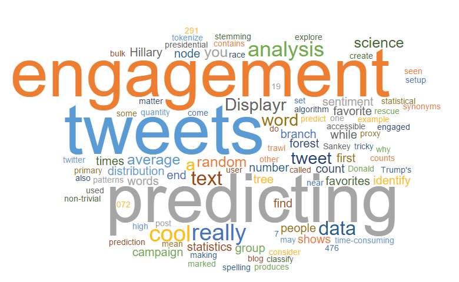

```{r setup, include=FALSE}
options(htmltools.dir.version = FALSE)
knitr::opts_chunk$set(messagwese=FALSE, warning = FALSE)
xaringanthemer::style_mono_accent(base_color ="#23395b", 
                                  title_slide_text_color="#23395b", 
                                  title_slide_background_color = "#fbf9f4", 
                                  background_color = "#fbf9f4", 
                                  link_color =  "#C93312")

options(htmltools.dir.version = FALSE)
knitr::opts_chunk$set(message=FALSE, warning = FALSE, error=TRUE, echo=FALSE, cache=TRUE)
```

```{r style-share-again, echo=FALSE}
xaringanExtra::use_tile_view()
xaringanExtra::use_panelset()

#xaringanExtra::style_share_again(
#  share_buttons = c("twitter", "linkedin", "pocket")
#)
```

name: about-me
layout: false
class: about-me-slide, inverse, middle, center

## .red[Quem sou?]


### Tiago Ventura

#### Postdoc Center for Social Medial and Politics, NYU

#### Professor Assistente Georgetown University

.fade[PhD, University of Maryland, College Park]

[`r icons::simple_icons("twitter")` @TiagoVentura_](https://twitter.com/_Tiagoventura)
[`r icons::simple_icons("github")` TiagoVentura](https://github.com/TiagoVentura)
[`r icons::ionicons("mail")` venturat@umd.edu](venturat@umd.edu)
[`r icons::ionicons("link-outline")`https://tiagoventura.rbind.io/](https://tiagoventura.rbind.io/)

---

class: middle

# Planos para hoje.

--

Apresentar uma visão geral sobre o campo das ciências sociais computacionais

--

- .blue[Estudos em CSS]

- .blue[Definições sobre CSS]

- .blue[Caracteristicas de estudos em CSS]

--
---
class: middle

# Planos para hoje.

#### **.red[Porque vocês devem investir na formação ciências sociais computacionais]**

---
class: center, middle

# Porque estamos e como chegamos aqui?

--

### Dados, Dados, Dados, Dados...

--
---

class: center, middle

```{r  echo=FALSE, out.width = "80%"}
 
```

---

# Mobilidade Digital

```{r  echo=FALSE, out.width = "80%"}
knitr::include_graphics("figs/mob_01.png") 
```

---

# Redes Sociais

```{r  echo=FALSE, out.width = "70%"}
knitr::include_graphics("figs/redes.png") 
```

---

## Dados Eleitorais

```{r  echo=FALSE, out.width = "70%"}
knitr::include_graphics("figs/eleicoes.png") 
```

---

## Text-as-Data

.pull-left[
```{r  echo=FALSE, out.width = "70%"}
knitr::include_graphics("figs/camara.png") 
```
]

.pull-right[
```{r  echo=FALSE, out.width = "70%"}
 
```
]

---

## Surveys On-line

```{r  echo=FALSE, out.width = "70%"}
knitr::include_graphics("figs/survey.png") 
```

---
## Super Computadores


```{r  echo=FALSE, out.width = "70%"}
knitr::include_graphics("figs/collab.png") 
```

---


class: center,middle

## `Mas, afinal, o que é CSS?`

--

```{r  echo=FALSE, out.width = "70%"}
 
```

---
class: middle, center


### We define CSS as the development and application of computational methods to complex, typically large-scale, human (sometimes simulated) behavioral data

.footnote[[Em Lazer et al 2020](https://www.science.org/doi/abs/10.1126/science.aaz8170)]


---
class: inverse, middle, center

## Aprendendo sobre CSS com alguns exemplos. 


---

# Bots no Twitter

```{r  echo=FALSE, out.width = "90%"}
 
```

.footnote[[Bail et al 2018](https://www.pnas.org/doi/10.1073/pnas.1804840115)]
---
### Resumo

```{r  echo=FALSE, out.width = "90%"}
knitr::include_graphics("figs/bail_design.jpg") 
```


---

## Experimento com chats no Facebook


.panelset[
.panel[
.panel-name[Artigos]
.pull-left[
```{r}

```
]

.pull-right[
```{r}

```
]
]

.panel[.panel-name[Chats]

.pull-left[

**Video Feed + Social Chat: All in one screen.**

Popular among the younger generations.

- Twitch (Amazon)
- YouTube/YouTube Gaming (Google)
- Mixer (Microsoft)
- Facebook Lives
]
.pull-right[
```{r out.width="80%"}
knitr::include_graphics("./figs/genelectionabc.png")
```
]
]

.panel[.panel-name[Field Experiment]

We conducted a large scale ''field" experiment that assigns would-be debate viewers to watch on different platforms the October 2019 Democratic Debate.

Two-Wave On-line Survey in September 2019 through MTurk (following Gross, Porter and Wood, 2019). 

**Three main experimental conditions**

- Control (standard NBC broadcast)
- Expert chat (538 website)
- Streaming chat (Facebook)

We then surveyed the respondents after the debate and measured the effects of streaming chats. 
]

.panel[.panel-name[Observational Setup]

#### Text Analysis

To complement our analysis, we built automatic scrapper (Selenium) to collect comments on facebook pages

- One Hundred Thousand Comments  from Facebook pages.

- Several Expert Chats

- Performed Dictionary Methods Sentiment Analysis. 

- Deep Learning Models to identify toxicity. 


]
]

---

## Ideologia com Dados de Twitter


```{r  echo=FALSE, out.width = "80%"}
 
```

.footnote[Inspirado em [Barbera et al.](https://www.cambridge.org/core/journals/political-analysis/article/birds-of-the-same-feather-tweet-together-bayesian-ideal-point-estimation-using-twitter-data/91E37205F69AEA32EF27F12563DC2A0A)]

---
## Mobilidade com dados de celulares e pandemia


```{r  echo=FALSE, out.width = "70%"}
 
```


.footnote[[More than Words](https://papers.ssrn.com/sol3/papers.cfm?abstract_id=3582908)]

---

class:center

```{r echo=FALSE, out.width="80%"}

```

.footnote[source: [Katrine Weler Gesis](https://www.youtube.com/watch?v=R-iqC_3cS80)]

---
class:middle, center
### Ciência Social Computacional = Ciência Social + Ciência de Dados.

---

### Ciência Social

- Entender Compartamento Social.

- Big Questions.

- Dilemas do Comportamento Humano.

- Explicar Mudanças e Padrões na Sociedade.

- Em geral, manipulação de banco de dados pequenos ou médios. 


---

### Ciências de Dados

- Estuda qualquer assunto.

- Aprende diretamente dos Dados - Modelos Estatísticos e ML.

- Big Data.

- Predição de mudanças e comportamentos.


---

class: center,middle


### Ciência de Dados não é suficiente sozinha se quisermos responder perguntas teóricamente orientadas

---
class: center,middle

### Cientistas Sociais isoladamente não possuem o conhecimento técnico para usar as novas bases de dados e métodos da era digital. 


---
class:middle, center
### Ciência Social Computacional = Ciência Social + Ciência de Dados.

---

class: inverse, center, middle

### Caracteristicas de Estudos em CSS

---
class:center, middle


### Readymade + Custommade data

--

### Equipes e pesquisas interdisciplinares

--

### Questões éticas se tornam mais relevantes

---
class: center, middle
## CSS: Desafios.

--

#### .blue[Big Data requer mais treinamento técnico]

--

#### .blue[Pouca oferta de cursos e treinamento]

--

#### .blue[Campo em emergência: universidades não possuem estrutura institucional]

--

#### .blue[Construir mais interdiciplinariedade e combinar técnica e teoria]

--


---
class: center, middle
## Porque jovens como voces devem investir em CSS?

--

#### .blue[Melhores oportunidades e mais opções no mercado de trabalho]

--


#### .blue[Produzir conhecimento na fronteira]

--

#### .blue[Produzir pesquisa com impacto social e responder dilemas da nossa sociedade digital]

--

#### .red[Trazer novas respostas a problemas antigos]

--

---
class: middle, center

## Onde posso aprender tudo isto? 

--
### **[Summer Institutes in Computational Social Sciences](https://sicss.io/)**
--

---
class: center, middle, inverse

### Obrigado!

